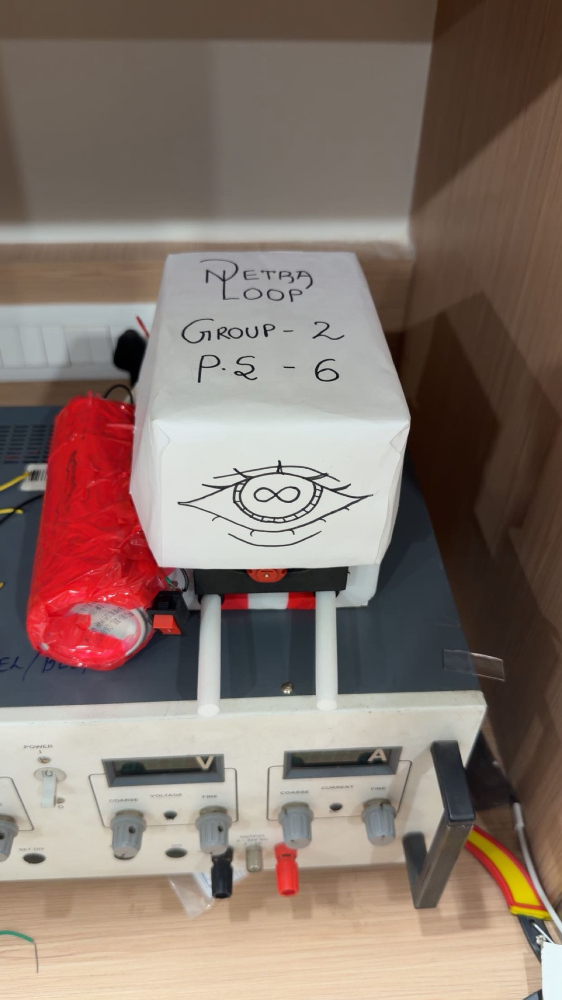
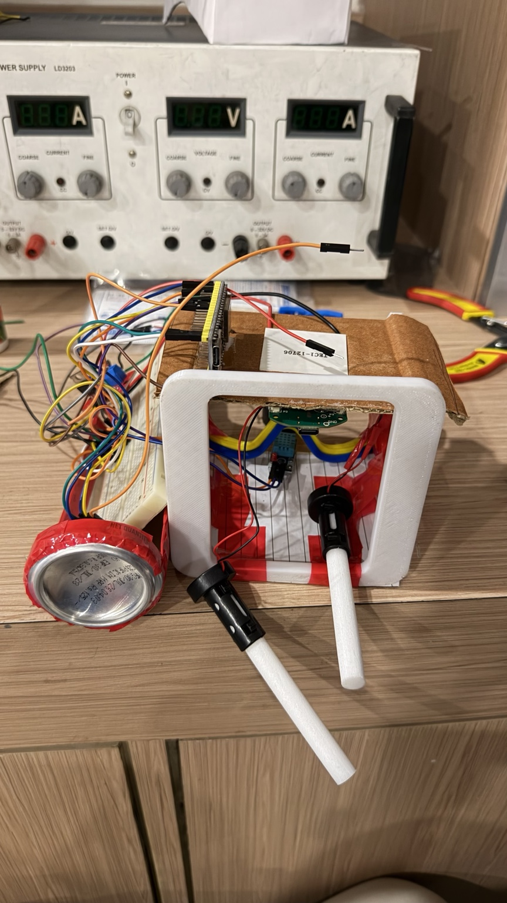
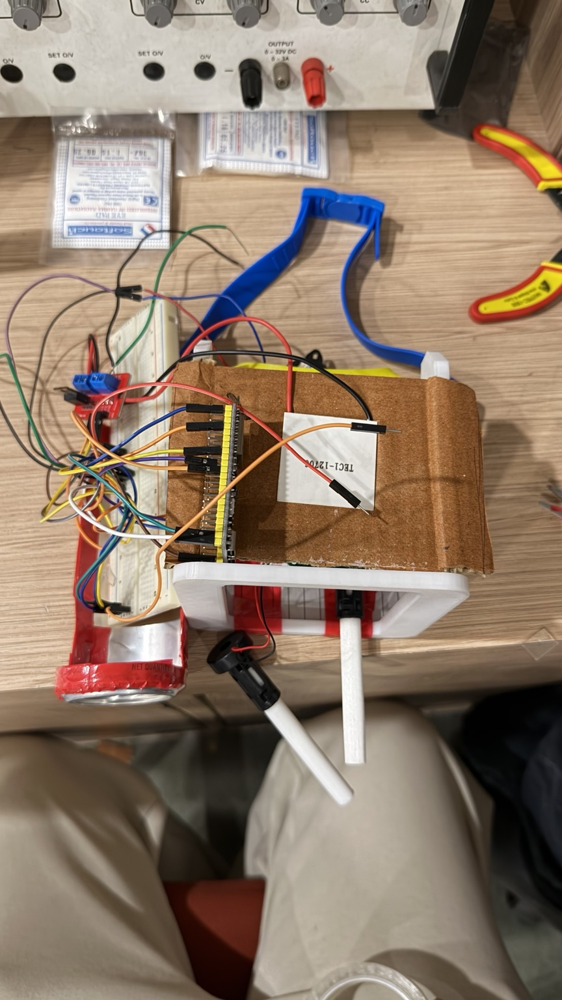
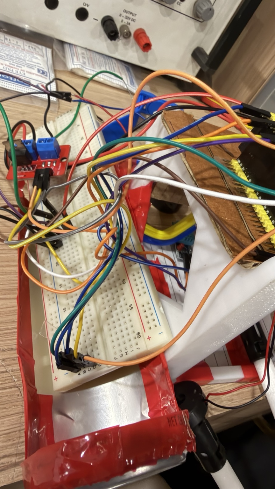
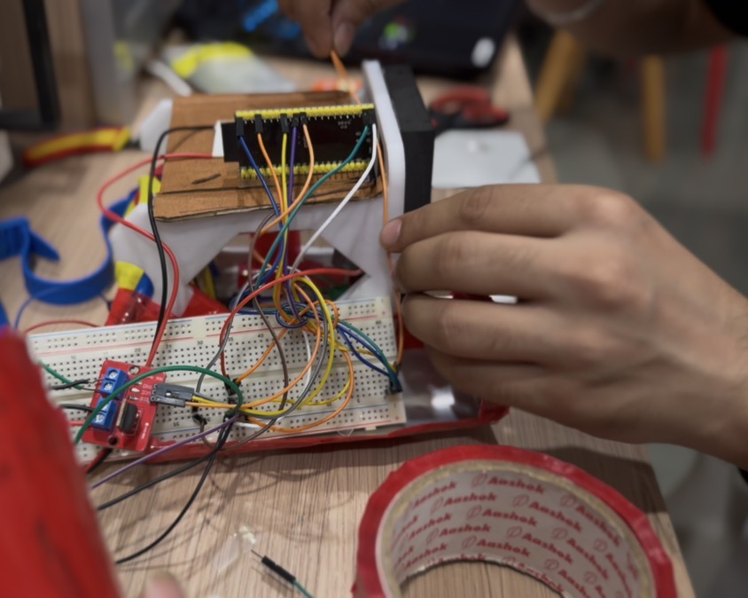

# Prototype of thermal-humidity ocular device for dry-eye therapy

An early bench-test proof of concept developed during MEDHA Medical Device Hackathon 2026. The project explored a small ESP32-controlled chamber for demonstrating temperature and humidity sensing around a closed-eye region.

This repository documents the prototype as it was built: a breadboard controller, an ESP32-S3, DHT11 sensing, a Peltier module, an IRF520 MOSFET module, an ultrasonic atomizer path, a buzzer, and a manually controlled power stage.

> **Safety note:** This is an educational engineering prototype, not a medical device. It has not been clinically validated. Do not place it on or near the eyes, and do not treat the software cutoff as a substitute for an independent hardware thermal cutoff.

## What is here

- `src/medha_thermal_humidity_poc.ino` — the Arduino sketch used for the controller demonstration.
- `docs/` — the system description, wiring notes, testing log template, and safety limitations.
- `images/` — selected photographs from the bench prototype.

## Prototype at a glance

The controller reads the DHT11 and reports temperature and relative humidity over Serial. A switch enables the session, a buzzer provides simple status/fault feedback, and GPIO outputs provide control signals to the external power stages. The current sketch keeps the high-power heater and atomizer paths disabled by default until the hardware is individually verified.

```text
DHT11 ──> ESP32-S3 ──> MOSFET driver ──> external load supply ──> Peltier
   │          │
   │          └────> buzzer / session switch
   └────────────────> temperature + humidity status
```

## Photographs











## Hardware used

- ESP32-S3 development board
- DHT11 temperature and humidity sensor
- TEC1-12706 Peltier module used as the available thermal actuator
- IRF520 MOSFET driver module
- Ultrasonic atomizer / piezoelectric mist module
- Buzzer and manual switch
- Breadboard, jumper wires, and a prototype enclosure
- External laboratory DC power supply for the high-current load

## Current status

The controller and environmental sensing path were the reliable part of the demonstration. The first atomizer available to the team was not working, and the Peltier path still required proper thermal characterization, heatsinking, current limiting, and verification. Those details are recorded rather than presented as completed validation.

## Limitations and next steps

The DHT11 measures chamber air, not the surface temperature at an eye interface. A future iteration would add a dedicated surface-temperature sensor, an independent hardware cutoff, current/voltage protection, a verified logic-level power stage, water-level sensing, condensation management, and a purpose-built enclosure. Any eventual medical use would require appropriate engineering, safety, regulatory, and clinical evaluation.

## Attribution

This was a rapid team prototype. The repository describes the hardware and software contribution without claiming sole authorship of the whole project.

## License

MIT for the source code and documentation. Prototype photographs are included for project documentation; please retain attribution if they are reused.
